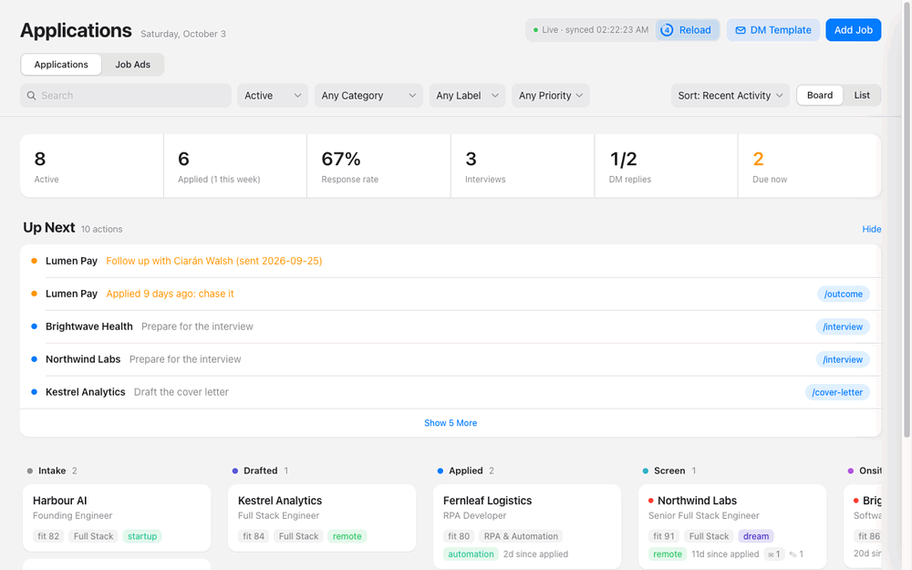
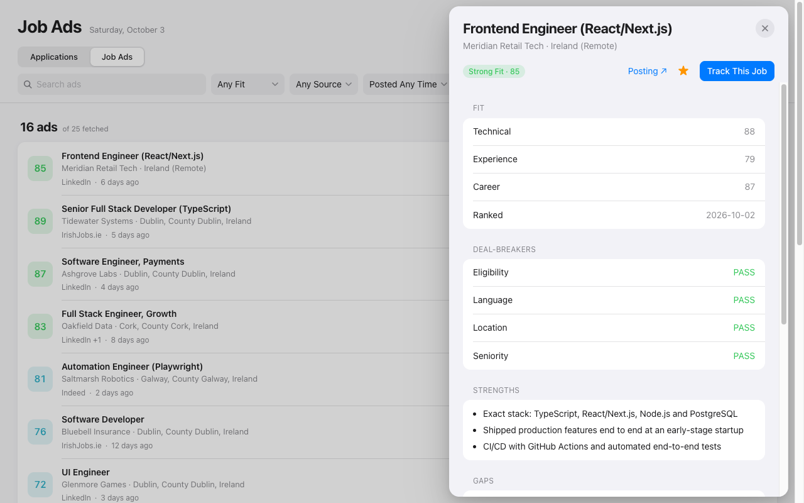
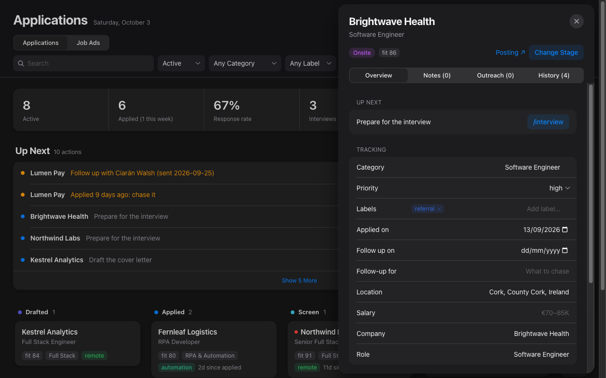

# Claude Code Job Search

**Your AI job-hunting crew for Claude Code: find jobs, shortlist the best fits, and send a tailored, ATS-ready CV and cover letter for each one, without inventing a single fact.**

[](https://claude.com/claude-code)
[](LICENSE)
[](cv/master-template.example.tex)
[](https://github.com/nomanAliShah786/claude-code-job-search/stargazers)

*Built by Noman, your friendly neighbourhood **jobless** Spider-Man. 🕷️ Peter Parker at least had a job at the Daily Bugle. I had a job-hunting spreadsheet and too many browser tabs, so I built this project. If it lands you a job before it lands me one, please send pizza.*

> ⭐ **If this saves you time, please star the repo.** It helps other job seekers find it, and it keeps me building.

## What it does

```
/fetch-jobs   →   /rank-jobs   →   /job-intake   →   /tailor-cv   →   /cover-letter   →   /interview
 500+ fresh        best fits        gap analysis      2-page ATS CV     letter + review     prep pack
 job ads           for you          for one job       for that job      before you send     + mock interview
```

- **Finds jobs for you, in any country:** collects the last 30 days of ads for your roles from LinkedIn and Indeed (plus IrishJobs.ie, Jobs.ie and Glassdoor in Ireland), with duplicates removed.
- **Ranks them honestly** against your real experience and your deal-breakers.
- **Tailors your CV per job**, using the job's keywords, but only where your evidence backs them. Every number traces to a source you recorded, so nothing is invented.
- **Checks every CV:** two pages at most, clean text for ATS parsers, a metric in every bullet, no repeated verbs.
- **Covers the rest:** cover letters, an ATS score out of 100, application tracking, follow-ups and interview prep.
- **Tracks it all on one page:** a local [job tracker](#job-tracker) shows your applications on a board and every fetched ad with its fit score, with notes, labels, referral outreach and follow-up reminders.

<p align="center">
  <a href="docs/sample-cv.pdf"></a>
  <a href="docs/sample-cv.pdf"></a>
  <br><em>A sample two-page CV built with this project (fictional candidate). <a href="docs/sample-cv.pdf">Open the PDF</a>.</em>
</p>

A LaTeX CV system plus a set of [Claude Code](https://claude.com/claude-code) skills that turn a job posting into a tailored, ATS-friendly CV of at most two pages, a cover letter, an application log, and interview prep. Every claim on a CV traces back to an evidence file you keep locally, so nothing is invented.

## Getting started (no coding experience needed)

> **Hi, I'm your Claude Project.** Spider-Man couldn't make it. His spider-sense keeps tingling at every "Thanks for applying, we'll be in touch" email, so he sent me instead. 🕸️ My superpower: I read 500 job ads before your coffee cools, and I never write "passionate team player".
> I'm the same kind of Claude Project you create in the Claude app, but here I get more powers.

**New to Claude? Chat vs Project in 30 seconds**

| | What it is | What Claude knows |
|---|---|---|
| **Claude chat** | One conversation in the Claude app | Only what you type into that chat. Each new chat starts from zero |
| **Claude Project** (in the app) | A workspace that holds your files and standing instructions | Every chat inside the project can read the same files and follows the same instructions, so you don't repeat yourself |
| **This project** (in Claude Code) | A Claude Project that lives as a folder on your computer | The same idea, plus Claude can *act*: open and edit files, build your CV into a PDF, browse job sites and run each step of an application |

If you've used Projects in the app, you already know this one:

- `CLAUDE.md` is the project's **instructions**.
- The files in `profile/` (your achievements, stories, preferences and old CVs) are the project's **knowledge**.
- The **skills** in `.claude/skills/` are the extra powers. They're step-by-step playbooks Claude follows, like `/tailor-cv` or `/fetch-jobs`.

Think of it like Tony Stark. A Claude Project in the app is Tony in the cave: smart, with your notes on the table, but it can only talk. This project is Tony in the Iron Man suit with JARVIS. It's the same Claude, but now it has the tools, the workshop, and written-down protocols for how you like things done.

Treat Claude here like a junior assistant who sits next to you. You can work with it in two ways:

- **Give an instruction:** "Make my CV fit this job ad." Claude does it once.
- **Build a system:** write down *how* you want something done (a **skill**), and Claude follows it the same way every time. The skills in this project are exactly that: systems that keep Claude aligned with you, like the protocols Steve Rogers drilled into the Avengers.

You'll type a few commands into a window where you give your computer text instructions: the **Terminal** on a Mac, **PowerShell** on Windows. **You never need to type a command yourself: copy and paste it.**

How to copy and paste a command:

1. Hover your mouse over a grey box below. A **copy icon** appears in its top-right corner. Click it.
2. Go to the Terminal (Mac) or PowerShell (Windows) window and click inside it.
3. Paste: press `Cmd + V` on a Mac, or right-click on Windows.
4. Press **Enter**.
5. Wait until it finishes: the blinking cursor comes back on a new line. Only then copy the next box.

### 1. Set up your computer (one time only)

**Pick your computer below and click it to open its steps.** Follow only that box and ignore the other one. Both end with the project downloaded to your home folder.

---

#### Mac

<details>
<summary><b>Click here to open the Mac steps</b></summary>

<br>

> You'll use the **Terminal**. Paste with `Cmd + V`.

1. **Open the Terminal.** Press `Cmd + Space`, type `Terminal`, and press Enter. A window with a blinking cursor opens. Keep it open for every step below.
2. **Install Git** (it downloads this project). Copy this box, go to the Terminal, paste it and press Enter:
   ```bash
   xcode-select --install
   ```
   A window pops up. Click **Install**, agree to the licence, and wait until it says the software was installed. If the Terminal says it's "already installed", that's fine: go to the next step.
3. **Install Claude Code** (the AI assistant that does the work). You need a paid Claude account (Pro or Max) at [claude.ai](https://claude.ai). Copy this box, go back to the Terminal, paste it and press Enter:
   ```bash
   curl -fsSL https://claude.ai/install.sh | bash
   ```
   Wait until the cursor comes back. If you see an error, follow the [official setup guide](https://docs.claude.com/en/docs/claude-code/setup).
4. **Install Node.js** (it runs the browser `/fetch-jobs` uses to read job sites). Open [nodejs.org](https://nodejs.org) in your web browser, click the **LTS** download button, open the downloaded file from your **Downloads** folder, and click **Continue** through the installer with the default options.
5. **Restart the Terminal.** Press `Cmd + Q` to quit it, then open it again as in step 1. This makes it see what you just installed.
6. **Check it worked.** Copy this box, paste it into the Terminal and press Enter:
   ```bash
   node --version
   ```
   You should see a version number such as `v22.x.x`. If you see "command not found", go back to step 4.
7. **Download the project.** Copy and paste these three boxes into the Terminal, one at a time, pressing Enter after each.

   Go to your home folder:
   ```bash
   cd ~
   ```
   Download the project there:
   ```bash
   git clone https://github.com/nomanAliShah786/claude-code-job-search.git
   ```
   Step inside the project folder:
   ```bash
   cd ~/claude-code-job-search
   ```
8. **Check you're in the right place.** Look at the line where the cursor blinks: it should now include `claude-code-job-search`. If you see "No such file or directory", the download didn't finish: paste the `git clone` box again.
9. **Make a folder for your old CVs.** Paste this box into the Terminal and press Enter. It creates the folder and opens it in Finder:
   ```bash
   mkdir -p ~/claude-code-job-search/profile/past-cvs && open ~/claude-code-job-search/profile/past-cvs
   ```
   A Finder window opens on an empty folder called `past-cvs`. Drag your old CV PDFs into it, then go back to the Terminal.

> [!TIP]
> **Downloaded the ZIP from GitHub instead?** That's where most people get lost. Open your **Downloads** folder in Finder and double-click the ZIP to unzip it. Go to the Terminal, type `cd` and a space (don't press Enter yet), then **drag the unzipped folder from Finder into the Terminal window** and press Enter. The Terminal fills in the folder's location for you. Then, instead of step 9, paste this box to make your CV folder and open it in Finder:
> ```bash
> mkdir -p profile/past-cvs && open profile/past-cvs
> ```
> Each time you come back, use this same `cd` and drag trick instead of the "Every time you come back" boxes.

**✅ Mac done.** Go to [step 2](#2-start-claude-in-the-project-folder).

</details>

---

#### Windows

<details>
<summary><b>Click here to open the Windows steps</b></summary>

<br>

> You'll use **PowerShell**. Paste by right-clicking inside it.

1. **Open PowerShell.** Press the Windows key, type `PowerShell`, and press Enter. A blue or black window with a blinking cursor opens. Keep it open for every step below.
2. **Install Git** (it downloads this project). Open [git-scm.com/download/win](https://git-scm.com/download/win) in your web browser and download the installer. Open it from your **Downloads** folder and click **Next** through every screen, keeping all the default options, then **Finish**.
3. **Install Claude Code** (the AI assistant that does the work). You need a paid Claude account (Pro or Max) at [claude.ai](https://claude.ai). Copy this box, go back to PowerShell, right-click to paste it and press Enter:
   ```powershell
   irm https://claude.ai/install.ps1 | iex
   ```
   Wait until the cursor comes back. If you see an error, follow the [official setup guide](https://docs.claude.com/en/docs/claude-code/setup).
4. **Install Node.js** (it runs the browser `/fetch-jobs` uses to read job sites). Open [nodejs.org](https://nodejs.org) in your web browser, click the **LTS** download button, open the downloaded file from your **Downloads** folder, and click **Next** through the installer with the default options.
5. **Restart PowerShell.** Close its window with the **X**, then open it again as in step 1. This makes it see what you just installed.
6. **Check it worked.** Copy this box, right-click to paste it into PowerShell and press Enter:
   ```powershell
   node --version
   ```
   You should see a version number such as `v22.x.x`. If you see "not recognized", go back to step 4.
7. **Download the project.** Copy and paste these three boxes into PowerShell, one at a time, pressing Enter after each.

   Go to your home folder:
   ```powershell
   cd ~
   ```
   Download the project there:
   ```powershell
   git clone https://github.com/nomanAliShah786/claude-code-job-search.git
   ```
   Step inside the project folder:
   ```powershell
   cd ~\claude-code-job-search
   ```
8. **Check you're in the right place.** Look at the line where the cursor blinks: it should now end in `claude-code-job-search>`. If you see "Cannot find path", the download didn't finish: paste the `git clone` box again.
9. **Make a folder for your old CVs.** Paste this box into PowerShell and press Enter. It creates the folder and opens it in File Explorer:
   ```powershell
   mkdir -Force $HOME\claude-code-job-search\profile\past-cvs; explorer $HOME\claude-code-job-search\profile\past-cvs
   ```
   A File Explorer window opens on an empty folder called `past-cvs`. Drag your old CV PDFs into it, then go back to PowerShell.

> [!TIP]
> **Downloaded the ZIP from GitHub instead?** That's where most people get lost. Open your **Downloads** folder in File Explorer, right-click the ZIP and choose **Extract All**, then **Extract**. Go to PowerShell, type `cd` and a space (don't press Enter yet), then **drag the extracted folder from File Explorer into the PowerShell window** and press Enter. PowerShell fills in the folder's location for you. Then, instead of step 9, paste this box to make your CV folder and open it in File Explorer:
> ```powershell
> mkdir -Force profile\past-cvs; explorer profile\past-cvs
> ```
> Each time you come back, use this same `cd` and drag trick instead of the "Every time you come back" boxes.

**✅ Windows done.** Go to [step 2](#2-start-claude-in-the-project-folder).

</details>

---

### 2. Start Claude in the project folder

1. **Start Claude.** Copy this box, go to the Terminal (Mac) or PowerShell (Windows), paste it and press Enter:
   ```bash
   claude
   ```
2. **Sign in (first time only).** Your web browser opens a Claude sign-in page. Sign in with your Claude account, then go back to the Terminal or PowerShell window.
3. **Trust the folder.** Claude asks whether you **trust the files in this folder**. Press the arrow keys to pick **Yes, proceed** and press Enter. This gives Claude access to the project folder, and only that folder.
4. **Answer permission questions.** Whenever Claude asks to edit a file or run a command, read the short description and choose **Yes**. Choose the "don't ask again" option for things you're happy with.
5. **Install the Playwright plugin (one time only).** It gives Claude a browser it can drive, which `/fetch-jobs` needs for Indeed (and IrishJobs.ie, Jobs.ie and Glassdoor in Ireland). Copy this box, paste it into Claude and press Enter:
   ```
   /plugin install playwright@claude-plugins-official
   ```
   Confirm when asked. Then paste `/exit` and press Enter to close Claude, and paste `claude` and press Enter to start it again so the plugin loads. To check it worked, paste `/mcp` and press Enter: **playwright** should be in the list. Prefer not to? Just tell Claude: `Install the Playwright plugin for me.`

**To stop Claude**, type `/exit` and press Enter, or press `Ctrl + C` twice.

**Every time you come back:** open the Terminal (Mac) or PowerShell (Windows) as in step 1 of your setup, then copy and paste these two boxes, one at a time, pressing Enter after each. They work no matter where the window starts:
```bash
cd ~/claude-code-job-search
```
```bash
claude
```

### 3. Your first conversation

You talk to Claude in plain English. Copy each box below, paste it into Claude, press Enter, and wait for Claude to finish before the next one.

1. **Install the CV builder.** Claude installs LaTeX, which turns the CV into a PDF. It's a large download and can take a while.
   ```
   Install everything this project needs to build a CV on my computer.
   ```
2. **Set up your profile** from the old CVs you dragged into `past-cvs` in step 9. Claude reads them and creates your profile files, your `CLAUDE.local.md` and your own CV from `cv/master-template.example.tex`. It asks you questions where something is missing: type your answers and press Enter.
   ```
   Set up my profile. My old CVs are in profile/past-cvs.
   ```
3. **Find and shortlist jobs.** Paste the first box, wait for it to finish, then paste the second.
   ```
   /fetch-jobs
   ```
   ```
   /rank-jobs
   ```
4. **Check a job and tailor your CV.** Open the job advert in your web browser and copy its text (or its web link). In Claude, type `/job-intake` and a space, paste the advert, and press Enter. When it finishes, paste this to get a CV tailored to that job:
   ```
   /tailor-cv
   ```
   Your new CV PDF is in the `cv/variants/` folder inside the project. To open that folder, ask Claude: `Open the folder with my tailored CV.`

Your personal files stay on your computer. They're listed under "Personal data stays local" below and are never uploaded to GitHub.

### 4. Lost? Just ask Claude in plain words

You don't need to remember any command. Talk to Claude the way you'd talk to a colleague. Start your message with **"Use the skills in this project"**, and Claude picks the right skills itself.

```
Use the skills in this project. I'm new here. What can you do for me, and where should I start?
```
```
Use the skills in this project. Find me frontend jobs in Dublin from this week and tell me the best five.
```
```
Use the skills in this project. Here is a job ad: <paste it>. Is it a good fit for me? If yes, make me a CV and a cover letter.
```
```
Use the skills in this project. I have an interview with Acme on Friday. Help me prepare.
```
```
Something went wrong and I don't understand the error. Explain it simply and fix it.
```

If an answer is confusing, say "explain that more simply" or "show me step by step". There are no silly questions. Even Peter Parker had to ask Tony how the suit worked.

### 5. You're not limited to these skills: make your own

The skills here are a starting kit, not the whole suit. You can ask Claude to build new ones, just like Tony keeps adding suits to the lab:

```
Make a new skill called salary-check. When I give you a job ad, it should look up typical salaries for that role in Ireland and tell me whether the offer is fair.
```
```
Make a new skill that writes a short LinkedIn message to the recruiter of a job I'm applying for.
```
```
Change the tailor-cv skill so it always mentions my AWS experience in the summary.
```

**Where skills live:** each skill is a plain text file you can open and read. In your file browser (Finder on Mac, File Explorer on Windows), open the project folder, then `.claude` → `skills` → a skill's folder → `SKILL.md`. It's written in plain English: the step-by-step instructions Claude follows when you use that skill. You can edit it yourself, or ask Claude to.

> **Can't see the `.claude` folder?** Folders whose name starts with a dot are hidden. On a Mac, press `Cmd + Shift + .` in Finder. On Windows, open File Explorer → **View** → **Show** → **Hidden items**.

A good habit: when you catch yourself telling Claude the same thing twice ("always put my certifications last", "never use the word 'passionate'"), ask Claude to **turn it into a skill or a rule**. Then it remembers every time. That's how you go from giving instructions to having a system.

### 6. Tips for the best results

- **One chat per job.** Start a fresh chat for each job application: type `/clear`, or `/exit` and run `claude` again. Your files, profile and skills carry over; only the conversation resets.
- **Keep chats short.** Claude gets noticeably "dumber" as a chat gets long: it forgets early details, mixes up jobs and makes more mistakes. Hulk is strongest fresh, not after ten rounds. If a chat feels slow or confused, start a new one rather than arguing with it.
- **Use the latest Opus model, at medium or high effort.** Type `/model`, choose the newest **Opus**, and set the effort to **medium** (everyday work) or **high** (CVs, cover letters and anything you'll send). Lower settings are faster but make more mistakes in your CV.

## How it works

1. Record your achievements once, with sources, in `profile/evidence.md`.
2. `/fetch-jobs` collects fresh ads and `/rank-jobs` shortlists them, or paste a job ad: `/job-intake` creates a job folder and a gap analysis.
3. `/tailor-cv` copies the master template, picks the evidence that fits the job, and compiles it with `cv/build.sh`, which checks the rules.
4. `/cover-letter`, `/ats-score`, `/outcome` and `/interview` cover the rest of the application.
5. The [job tracker](#job-tracker) shows where every application stands and what to do next.

The CV rules (section order, bullet rules, bolding, ATS constraints) live in `CLAUDE.md`.

## Layout

| Path | What it is |
|---|---|
| `CLAUDE.md` | Project instructions: the CV system and workflow rules Claude follows |
| `cv/master-template.example.tex` | The master CV layout with placeholder content. Copy it to `cv/master-template.tex` *(gitignored)* and fill in your own CV; every variant is copied from that |
| `cv/build.sh` | Compiles a CV and checks page count, bullets, dashes, TODOs, LaTeX warnings and text extraction |
| `cv/variants/` | One tailored `.tex` + PDF per application *(gitignored)* |
| `cv/build/` | pdflatex build output *(gitignored)* |
| `profile/` | Your evidence, stories, preferences and past CVs *(gitignored)* |
| `jobs/_template/` | Scaffold for each application: `posting.md`, `analysis.md`, `cover-letter.md`, `status.md` |
| `jobs/<date>-<company>-<role>/` | One folder per application *(gitignored)* |
| `jobs/tracker.json` | Labels, notes, outreach and starred or hidden ads saved by the job tracker *(gitignored)* |
| `tools/tracker/` | The [job tracker](#job-tracker): a small Node.js server and one HTML page |
| `research/` | Job ads saved by `/fetch-jobs` (`research/<date>-jobs/combined.jsonl`) and read by `/rank-jobs` *(gitignored)* |
| `.claude/skills/` | The Claude Code skills listed below |

## Personal data stays local

`profile/`, `jobs/*` (except `jobs/_template/`), `cv/master-template.tex`, `cv/variants/`, `cv/build/`, `cv/*.pdf`, `research/` and `CLAUDE.local.md` are gitignored. After cloning, create these yourself:

| File | Purpose |
|---|---|
| `profile/evidence.md` | Achievements, each with a stable ID (e.g. `E-ACME-01`) and a source; plus education and skills |
| `profile/stories.md` | STAR interview answers that cite evidence IDs |
| `profile/job-preferences.md` | Deal-breakers (work authorisation, locations, languages, seniority) used by `/rank-jobs` |
| `profile/certifications.md` | Certification targets, progress and certificates held |
| `profile/past-cvs/` | Your previous CVs (PDF), the source of truth for experience and metrics |
| `cv/master-template.tex` | Your own CV, copied from `cv/master-template.example.tex` |
| `CLAUDE.local.md` | Your personal instructions for Claude (target roles, location, preferences); Claude Code loads it alongside `CLAUDE.md` |

## Prerequisites

- A TeX distribution with `pdflatex` (MacTeX/BasicTeX, TeX Live or MiKTeX), with the packages `mathpazo`, `enumitem`, `paracol`, `ragged2e`, `xcolor` and `hyperref`. Overleaf with the pdfLaTeX compiler also works.
- Bash, to run `cv/build.sh`.
- Optional: `pdfinfo` (poppler) for the page count, and Python 3 with `pypdf` (`python3 -m pip install --user pypdf`) for the ATS text-extraction check. The script skips or falls back when they're missing.
- [Claude Code](https://claude.com/claude-code), for the skills.
- For the job tracker: Node.js 18 or later. No `npm install` needed.
- For `/fetch-jobs`: `curl`, Python 3, Node.js, and the Playwright plugin in Claude Code (`/plugin install playwright@claude-plugins-official`) for Indeed and the Irish job boards. LinkedIn works without it.

## Build a CV

```bash
cv/build.sh cv/master-template.tex
cv/build.sh cv/variants/2026-09-acme-senior-backend.tex
```

The PDF lands next to the `.tex`. Output reports the page count plus any `FAIL:` (hard rule broken, exit 2) or `WARN:` lines; exit 1 means the build failed.

## Skills

| Command | What it does |
|---|---|
| `/fetch-jobs [--country] [--location] [--roles] [--sites] [--interval]` | Collects job ads from the last 30 days, for any country and role, into one deduplicated file |
| `/job-intake <JD text or URL>` | Scaffolds a job folder from a posting and writes a gap analysis against your evidence |
| `/rank-jobs [ads file \| URLs]` | Scores saved ads or posting URLs against your evidence and preferences; returns a ranked shortlist |
| `/tailor-cv <job slug>` | Builds a tailored, two-page-maximum CV variant for one job, compiles it and runs the checklist |
| `/cover-letter <job slug>` | Drafts the cover letter, then a separate reviewer agent critiques the CV and letter |
| `/ats-score [job slug] [CV]` | Scores a CV out of 100 on six ATS factors, compares it with the master, and lists fixes |
| `/outcome [slug \| followup \| stale]` | Logs application stages in `status.md` and drafts follow-up notes (never sends them) |
| `/interview <job slug>` | Builds a stage-specific interview prep pack and offers a mock interview |

## Fetch jobs

```
/fetch-jobs                                                   your roles and country from your profile
/fetch-jobs --country "United Kingdom" --location London --roles "frontend developer|react developer"
/fetch-jobs --country Germany --location Berlin --sites linkedin
/fetch-jobs --interval 4-10                                   wait a random 4–10 s between requests
```

Or just ask in plain words: `Use the skills in this project. Find me product designer jobs in Toronto from the last month.`

- **Any country, any role.** LinkedIn and Indeed work worldwide. In Ireland, IrishJobs.ie, Jobs.ie and Glassdoor are searched too. Without arguments, Claude uses the target roles and location from your `CLAUDE.local.md` and `profile/job-preferences.md`, and asks if they're missing.

- **Interval.** `--interval MIN-MAX` sets the random gap in seconds between requests on every site (minimum 1). Without it each site keeps its tested default: LinkedIn 1.2–6 s, Indeed 5–16 s, the others 1–3 s. Use a wider range if a site starts blocking.
- **What happens.** LinkedIn is fetched with curl. The other sites run in a Playwright browser that Claude drives; sign in to Indeed in its tab for more results. Every script is resumable, so a stopped run picks up where it left off.
- **Output.** `research/<date>-<country>-jobs/raw/` holds each site's raw results, and `combined.jsonl` holds the deduplicated ads with a link to each (your titles only, no intern or manager roles). Run `/rank-jobs` next.
- **When stuck.** If a site shows a captcha, a sign-in wall or a "just a moment" page, Claude stops that site and sends you a notification. Solve it in the browser and reply, and the run continues. Claude never tries to bypass a check.
- **Defaults.** With no roles set anywhere, the scripts search software engineer and full stack roles in Ireland. The 30-day window is set in each script in `.claude/skills/fetch-jobs/scripts/`.

## Job tracker

A local web page for keeping track of your job search. It reads and writes the files in this project, so it stays in step with the skills.

<p align="center">
  
  <br><em>A tour of the tracker with demo data (fictional companies and jobs).</em>
</p>

```bash
node tools/tracker/server.mjs        # then open http://localhost:4321
PORT=5000 node tools/tracker/server.mjs
```

**Applications** shows every folder in `jobs/`:

- **Board or list.** Drag a card to a new stage, or use Change Stage. Either way it updates **Current stage** and adds a dated row to that job's `status.md`, just as `/outcome` does.
- **Up Next.** Suggests the next step for each job (build the CV, draft the cover letter, chase an application after 7 days, mark it no-response after 21) with a button that copies the matching slash command.
- **Per job.** Category, priority, labels, applied date, follow-up date, salary, location and dated notes. Posting, CV variant and contact are edited straight into `status.md`.
- **Outreach.** Log the people you contact for a referral or a cold DM: channel, status, sent date and follow-up date. Draft a message from your own template (DM Template, with `{first}`, `{company}`, `{role}`, `{pitch}` and `{me}` placeholders) and copy it. Nothing is ever sent for you.
- **Stats.** Active applications, applications this week, response rate, interviews, DM replies and actions due.

**Job Ads** shows every ad from `research/*/combined.jsonl`, with fit scores from `/rank-jobs` (`jobs/_ranking/scores.jsonl`):

- Search and filter by fit, source, posting date and status (not yet tracked, starred, tracked, hidden, skipped).
- Open an ad to see its fit breakdown, deal-breaker checks, strengths, gaps and the full description.
- **Track This Job** creates the job folder from `jobs/_template/`, with the posting already filled in. Run `/job-intake` next for the gap analysis.

Details:

- **Always current.** The page refreshes itself every 5 seconds, so changes made by the skills or by hand show up on their own. It waits while you're typing, and the **Reload** button refreshes on demand. Each check only compares file timestamps, and data is downloaded only when something actually changed.
- **Where data lives.** Stage, posting, CV and contact stay in each `status.md`. Everything else goes in `jobs/tracker.json`, created on your first save. Your DM template is kept in the browser.
- **Private.** The server listens only on `127.0.0.1`, has no dependencies, and never sends data anywhere.
- **Any screen.** Light and dark mode, and a layout that works on a phone. Dragging cards needs a mouse; on a touch screen, use Change Stage.

<table>
  <tr>
    <td width="50%"><br><em>Applications: stats, Up Next and the board</em></td>
    <td width="50%"><br><em>Job Ads: fit scores, deal-breakers and strengths</em></td>
  </tr>
  <tr>
    <td colspan="2" align="center"><br><em>Dark mode</em></td>
  </tr>
</table>

## Remote Control and phone notifications

Remote Control lets you follow and answer a local Claude Code session from [claude.ai/code](https://claude.ai/code) or the Claude mobile app, so a long `/fetch-jobs` run can ask you for help while you're away from the computer.

1. Start Claude Code in this folder with Remote Control on:
   ```bash
   claude --remote-control            # interactive session you can also use at the desk
   claude remote-control --name jobs  # or a session you drive only from the web or app
   ```
   `claude remote-control -c` reattaches to the last session from this folder (within about 4 hours).
2. Open the session in the Claude mobile app or at claude.ai/code, signed in to the same account.
3. Run `/fetch-jobs` as usual. While Remote Control is connected, Claude's notifications (finished runs, captchas, sign-in walls) also go to your phone. When you're at the terminal they show there instead.
4. Reply from your phone to continue, e.g. after solving a captcha on the computer.

Allow phone notifications for the Claude app in your phone's settings. For a fully unattended run, start with `--permission-mode acceptEdits` or `auto` (see `claude remote-control --help`) so Claude doesn't wait on approval prompts.

## Contributing

Ideas, bug reports and new skills are welcome. Read [CONTRIBUTING.md](CONTRIBUTING.md), then [open an issue](https://github.com/nomanAliShah786/claude-code-job-search/issues/new/choose). New in this release? See the [changelog](CHANGELOG.md).

If this project helped you land an interview or a job, I'd love to hear about it. Open an issue with the **Success story** template. ⭐ Stars are appreciated too.

## Credits and licence

`/rank-jobs`, `/cover-letter`, `/outcome` and `/interview` are adapted from [ai-job-search](https://github.com/MadsLorentzen/ai-job-search) by Mads Lorentzen (MIT). See [THIRD_PARTY_NOTICES.md](THIRD_PARTY_NOTICES.md) for what was adapted and the original licence notice.

This project is released under the [MIT License](LICENSE).
