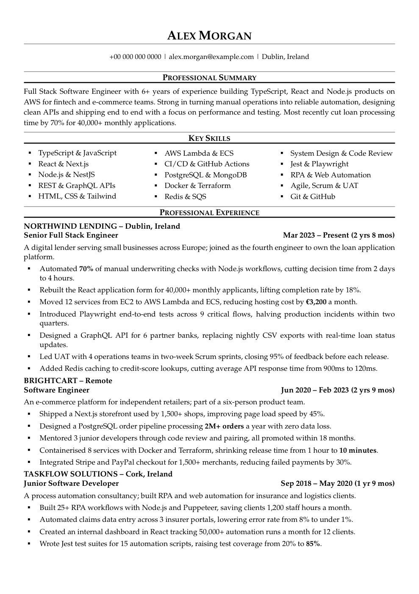

# Claude Code Job Search

**Your AI job-hunting crew for Claude Code: find jobs, shortlist the best fits, and send a tailored, ATS-ready CV and cover letter for each one, without inventing a single fact.**

[](https://claude.com/claude-code)
[](LICENSE)
[](cv/master-template.example.tex)
[](https://github.com/nomanAliShah786/claude-code-job-search/stargazers)

*Built by Noman, your friendly neighbourhood **jobless** Spider-Man. 🕷️ Peter Parker at least had a job at the Daily Bugle. I had a job-hunting spreadsheet and too many browser tabs, so I built this project. If it lands you a job before it lands me one, please send pizza.*

> ⭐ **If this saves you time, please star the repo.** It helps other job seekers find it, and it keeps me building.

## What it does

```
/fetch-jobs   →   /rank-jobs   →   /job-intake   →   /tailor-cv   →   /cover-letter   →   /interview
 500+ fresh        best fits        gap analysis      2-page ATS CV     letter + review     prep pack
 job ads           for you          for one job       for that job      before you send     + mock interview
```

- **Finds jobs for you, in any country:** collects the last 30 days of ads for your roles from LinkedIn and Indeed (plus IrishJobs.ie, Jobs.ie and Glassdoor in Ireland), with duplicates removed.
- **Ranks them honestly** against your real experience and your deal-breakers.
- **Tailors your CV per job**, using the job's keywords, but only where your evidence backs them. Every number traces to a source you recorded, so nothing is invented.
- **Checks every CV:** two pages at most, clean text for ATS parsers, a metric in every bullet, no repeated verbs.
- **Covers the rest:** cover letters, an ATS score out of 100, application tracking, follow-ups and interview prep.

<p align="center">
  <a href="docs/sample-cv.pdf"></a>
  <a href="docs/sample-cv.pdf"></a>
  <br><em>A sample two-page CV built with this project (fictional candidate). <a href="docs/sample-cv.pdf">Open the PDF</a>.</em>
</p>

A LaTeX CV system plus a set of [Claude Code](https://claude.com/claude-code) skills that turn a job posting into a tailored, ATS-friendly CV of at most two pages, a cover letter, an application log, and interview prep. Every claim on a CV traces back to an evidence file you keep locally, so nothing is invented.

## Getting started (no coding experience needed)

> **Hi, I'm your Claude Project.** Spider-Man couldn't make it. His spider-sense keeps tingling at every "Thanks for applying, we'll be in touch" email, so he sent me instead. 🕸️ My superpower: I read 500 job ads before your coffee cools, and I never write "passionate team player".
> I'm the same kind of Claude Project you create in the Claude app, but here I get more powers.

**New to Claude? Chat vs Project in 30 seconds**

| | What it is | What Claude knows |
|---|---|---|
| **Claude chat** | One conversation in the Claude app | Only what you type into that chat. Each new chat starts from zero |
| **Claude Project** (in the app) | A workspace that holds your files and standing instructions | Every chat inside the project can read the same files and follows the same instructions, so you don't repeat yourself |
| **This project** (in Claude Code) | A Claude Project that lives as a folder on your computer | The same idea, plus Claude can *act*: open and edit files, build your CV into a PDF, browse job sites and run each step of an application |

If you've used Projects in the app, you already know this one:

- `CLAUDE.md` is the project's **instructions**.
- The files in `profile/` (your achievements, stories, preferences and old CVs) are the project's **knowledge**.
- The **skills** in `.claude/skills/` are the extra powers. They're step-by-step playbooks Claude follows, like `/tailor-cv` or `/fetch-jobs`.

Think of it like Tony Stark. A Claude Project in the app is Tony in the cave: smart, with your notes on the table, but it can only talk. This project is Tony in the Iron Man suit with JARVIS. It's the same Claude, but now it has the tools, the workshop, and written-down protocols for how you like things done.

Treat Claude here like a junior assistant who sits next to you. You can work with it in two ways:

- **Give an instruction:** "Make my CV fit this job ad." Claude does it once.
- **Build a system:** write down *how* you want something done (a **skill**), and Claude follows it the same way every time. The skills in this project are exactly that: systems that keep Claude aligned with you, like the protocols Steve Rogers drilled into the Avengers.

You'll type a few commands into the **Terminal**, a window where you give your computer text instructions. Copy each command, paste it into the Terminal, and press **Enter**.

- **Mac:** press `Cmd + Space`, type `Terminal`, press Enter.
- **Windows:** press the Windows key, type `PowerShell`, press Enter.

### 1. Install the tools (one time only)

1. **Git** downloads this project to your computer.
   - Mac: run `xcode-select --install` and click **Install** in the window that opens.
   - Windows: download and install it from [git-scm.com](https://git-scm.com/download/win), keeping all the default options.
2. **Claude Code** is the AI assistant that does the work. You need a paid Claude account (Pro or Max) at [claude.ai](https://claude.ai).
   - Mac: `curl -fsSL https://claude.ai/install.sh | bash`
   - Windows (PowerShell): `irm https://claude.ai/install.ps1 | iex`
   - If anything goes wrong, follow the official guide at [docs.claude.com/en/docs/claude-code/setup](https://docs.claude.com/en/docs/claude-code/setup).
3. **Node.js** runs the Playwright browser that `/fetch-jobs` uses to read job sites. Download the **LTS** version from [nodejs.org](https://nodejs.org) and install it with the default options. To check it worked, run `node --version` in a new Terminal; you should see a version number such as `v22.x.x`.
4. Close the Terminal and open a new one, so it picks up what you just installed.

### 2. Download (clone) this project

Run these two commands one at a time. The first downloads the project into a folder called `claude-code-job-search`, and the second moves the Terminal into that folder:

```bash
git clone https://github.com/nomanAliShah786/claude-code-job-search.git
cd claude-code-job-search
```

The folder is in your home folder: on a Mac, open Finder and press `Cmd + Shift + H`. You can also use the green **Code → Download ZIP** button on GitHub and unzip it instead, but you then have to `cd` into wherever you unzipped it.

### 3. Start Claude in the project folder

1. Make sure the Terminal is inside the project folder. If you opened a new Terminal, run `cd claude-code-job-search` first.
2. Run:
   ```bash
   claude
   ```
3. The first time, Claude opens your browser to sign in. Sign in with your Claude account, then go back to the Terminal.
4. Claude asks whether you **trust the files in this folder**. Choose **Yes, proceed**. This gives Claude access to the project folder, and only that folder.
5. When Claude asks permission to edit a file or run a command, read the short description and choose **Yes**. Choose the "don't ask again" option for things you're happy with.

6. **Install the Playwright plugin (one time only).** It gives Claude a browser it can drive, which `/fetch-jobs` needs for Indeed (and IrishJobs.ie, Jobs.ie and Glassdoor in Ireland). Inside Claude, type:
   ```
   /plugin install playwright@claude-plugins-official
   ```
   Confirm when asked, then type `/exit` and run `claude` again so the plugin loads. To check it worked, type `/mcp`: **playwright** should be in the list. Prefer not to type commands? Just tell Claude: `Install the Playwright plugin for me.`

To stop Claude, type `/exit` or press `Ctrl + C` twice. Next time, open the Terminal and run `cd claude-code-job-search` and then `claude`.

### 4. Your first conversation

You talk to Claude in plain English. Type these one at a time and press Enter:

1. `Install everything this project needs to build a CV on my computer.` Claude installs LaTeX, which turns the CV into a PDF. It's a large download and can take a while.
2. `Set up my profile. My old CVs are in <folder>.` Put your old CV PDFs in a folder first, for example `profile/past-cvs/` inside the project. Claude reads them and creates your profile files, your `CLAUDE.local.md` and your own CV from `cv/master-template.example.tex`. It asks you questions where something is missing.
3. `/fetch-jobs`, then `/rank-jobs`, to find and shortlist jobs.
4. Type `/job-intake`, a space, then paste the job advert (or its web link) and press Enter. Then type `/tailor-cv` to get a CV tailored to that job.

Your personal files stay on your computer. They're listed under "Personal data stays local" below and are never uploaded to GitHub.

### 5. Lost? Just ask Claude in plain words

You don't need to remember any command. Talk to Claude the way you'd talk to a colleague. Start your message with **"Use the skills in this project"**, and Claude picks the right skills itself.

```
Use the skills in this project. I'm new here. What can you do for me, and where should I start?
```
```
Use the skills in this project. Find me frontend jobs in Dublin from this week and tell me the best five.
```
```
Use the skills in this project. Here is a job ad: <paste it>. Is it a good fit for me? If yes, make me a CV and a cover letter.
```
```
Use the skills in this project. I have an interview with Acme on Friday. Help me prepare.
```
```
Something went wrong and I don't understand the error. Explain it simply and fix it.
```

If an answer is confusing, say "explain that more simply" or "show me step by step". There are no silly questions. Even Peter Parker had to ask Tony how the suit worked.

### 6. You're not limited to these skills: make your own

The skills here are a starting kit, not the whole suit. You can ask Claude to build new ones, just like Tony keeps adding suits to the lab:

```
Make a new skill called salary-check. When I give you a job ad, it should look up typical salaries for that role in Ireland and tell me whether the offer is fair.
```
```
Make a new skill that writes a short LinkedIn message to the recruiter of a job I'm applying for.
```
```
Change the tailor-cv skill so it always mentions my AWS experience in the summary.
```

**Where skills live:** each skill is a plain text file you can open and read. In your file browser (Finder on Mac, File Explorer on Windows), open the project folder, then `.claude` → `skills` → a skill's folder → `SKILL.md`. It's written in plain English: the step-by-step instructions Claude follows when you use that skill. You can edit it yourself, or ask Claude to.

> **Can't see the `.claude` folder?** Folders whose name starts with a dot are hidden. On a Mac, press `Cmd + Shift + .` in Finder. On Windows, open File Explorer → **View** → **Show** → **Hidden items**.

A good habit: when you catch yourself telling Claude the same thing twice ("always put my certifications last", "never use the word 'passionate'"), ask Claude to **turn it into a skill or a rule**. Then it remembers every time. That's how you go from giving instructions to having a system.

### 7. Tips for the best results

- **One chat per job.** Start a fresh chat for each job application: type `/clear`, or `/exit` and run `claude` again. Your files, profile and skills carry over; only the conversation resets.
- **Keep chats short.** Claude gets noticeably "dumber" as a chat gets long: it forgets early details, mixes up jobs and makes more mistakes. Hulk is strongest fresh, not after ten rounds. If a chat feels slow or confused, start a new one rather than arguing with it.
- **Use the latest Opus model, at medium or high effort.** Type `/model`, choose the newest **Opus**, and set the effort to **medium** (everyday work) or **high** (CVs, cover letters and anything you'll send). Lower settings are faster but make more mistakes in your CV.

## How it works

1. Record your achievements once, with sources, in `profile/evidence.md`.
2. `/fetch-jobs` collects fresh ads and `/rank-jobs` shortlists them, or paste a job ad: `/job-intake` creates a job folder and a gap analysis.
3. `/tailor-cv` copies the master template, picks the evidence that fits the job, and compiles it with `cv/build.sh`, which checks the rules.
4. `/cover-letter`, `/ats-score`, `/outcome` and `/interview` cover the rest of the application.

The CV rules (section order, bullet rules, bolding, ATS constraints) live in `CLAUDE.md`.

## Layout

| Path | What it is |
|---|---|
| `CLAUDE.md` | Project instructions: the CV system and workflow rules Claude follows |
| `cv/master-template.example.tex` | The master CV layout with placeholder content. Copy it to `cv/master-template.tex` *(gitignored)* and fill in your own CV; every variant is copied from that |
| `cv/build.sh` | Compiles a CV and checks page count, bullets, dashes, TODOs, LaTeX warnings and text extraction |
| `cv/variants/` | One tailored `.tex` + PDF per application *(gitignored)* |
| `cv/build/` | pdflatex build output *(gitignored)* |
| `profile/` | Your evidence, stories, preferences and past CVs *(gitignored)* |
| `jobs/_template/` | Scaffold for each application: `posting.md`, `analysis.md`, `cover-letter.md`, `status.md` |
| `jobs/<date>-<company>-<role>/` | One folder per application *(gitignored)* |
| `research/` | Job ads saved by `/fetch-jobs` (`research/<date>-jobs/combined.jsonl`) and read by `/rank-jobs` *(gitignored)* |
| `.claude/skills/` | The Claude Code skills listed below |

## Personal data stays local

`profile/`, `jobs/*` (except `jobs/_template/`), `cv/master-template.tex`, `cv/variants/`, `cv/build/`, `cv/*.pdf`, `research/` and `CLAUDE.local.md` are gitignored. After cloning, create these yourself:

| File | Purpose |
|---|---|
| `profile/evidence.md` | Achievements, each with a stable ID (e.g. `E-ACME-01`) and a source; plus education and skills |
| `profile/stories.md` | STAR interview answers that cite evidence IDs |
| `profile/job-preferences.md` | Deal-breakers (work authorisation, locations, languages, seniority) used by `/rank-jobs` |
| `profile/certifications.md` | Certification targets, progress and certificates held |
| `profile/past-cvs/` | Your previous CVs (PDF), the source of truth for experience and metrics |
| `cv/master-template.tex` | Your own CV, copied from `cv/master-template.example.tex` |
| `CLAUDE.local.md` | Your personal instructions for Claude (target roles, location, preferences); Claude Code loads it alongside `CLAUDE.md` |

## Prerequisites

- A TeX distribution with `pdflatex` (MacTeX/BasicTeX, TeX Live or MiKTeX), with the packages `mathpazo`, `enumitem`, `paracol`, `ragged2e`, `xcolor` and `hyperref`. Overleaf with the pdfLaTeX compiler also works.
- Bash, to run `cv/build.sh`.
- Optional: `pdfinfo` (poppler) for the page count, and Python 3 with `pypdf` (`python3 -m pip install --user pypdf`) for the ATS text-extraction check. The script skips or falls back when they're missing.
- [Claude Code](https://claude.com/claude-code), for the skills.
- For `/fetch-jobs`: `curl`, Python 3, Node.js, and the Playwright plugin in Claude Code (`/plugin install playwright@claude-plugins-official`) for Indeed and the Irish job boards. LinkedIn works without it.

## Build a CV

```bash
cv/build.sh cv/master-template.tex
cv/build.sh cv/variants/2026-09-acme-senior-backend.tex
```

The PDF lands next to the `.tex`. Output reports the page count plus any `FAIL:` (hard rule broken, exit 2) or `WARN:` lines; exit 1 means the build failed.

## Skills

| Command | What it does |
|---|---|
| `/fetch-jobs [--country] [--location] [--roles] [--sites] [--interval]` | Collects job ads from the last 30 days, for any country and role, into one deduplicated file |
| `/job-intake <JD text or URL>` | Scaffolds a job folder from a posting and writes a gap analysis against your evidence |
| `/rank-jobs [ads file \| URLs]` | Scores saved ads or posting URLs against your evidence and preferences; returns a ranked shortlist |
| `/tailor-cv <job slug>` | Builds a tailored, two-page-maximum CV variant for one job, compiles it and runs the checklist |
| `/cover-letter <job slug>` | Drafts the cover letter, then a separate reviewer agent critiques the CV and letter |
| `/ats-score [job slug] [CV]` | Scores a CV out of 100 on six ATS factors, compares it with the master, and lists fixes |
| `/outcome [slug \| followup \| stale]` | Logs application stages in `status.md` and drafts follow-up notes (never sends them) |
| `/interview <job slug>` | Builds a stage-specific interview prep pack and offers a mock interview |

## Fetch jobs

```
/fetch-jobs                                                   your roles and country from your profile
/fetch-jobs --country "United Kingdom" --location London --roles "frontend developer|react developer"
/fetch-jobs --country Germany --location Berlin --sites linkedin
/fetch-jobs --interval 4-10                                   wait a random 4–10 s between requests
```

Or just ask in plain words: `Use the skills in this project. Find me product designer jobs in Toronto from the last month.`

- **Any country, any role.** LinkedIn and Indeed work worldwide. In Ireland, IrishJobs.ie, Jobs.ie and Glassdoor are searched too. Without arguments, Claude uses the target roles and location from your `CLAUDE.local.md` and `profile/job-preferences.md`, and asks if they're missing.

- **Interval.** `--interval MIN-MAX` sets the random gap in seconds between requests on every site (minimum 1). Without it each site keeps its tested default: LinkedIn 1.2–6 s, Indeed 5–16 s, the others 1–3 s. Use a wider range if a site starts blocking.
- **What happens.** LinkedIn is fetched with curl. The other sites run in a Playwright browser that Claude drives; sign in to Indeed in its tab for more results. Every script is resumable, so a stopped run picks up where it left off.
- **Output.** `research/<date>-<country>-jobs/raw/` holds each site's raw results, and `combined.jsonl` holds the deduplicated ads with a link to each (your titles only, no intern or manager roles). Run `/rank-jobs` next.
- **When stuck.** If a site shows a captcha, a sign-in wall or a "just a moment" page, Claude stops that site and sends you a notification. Solve it in the browser and reply, and the run continues. Claude never tries to bypass a check.
- **Defaults.** With no roles set anywhere, the scripts search software engineer and full stack roles in Ireland. The 30-day window is set in each script in `.claude/skills/fetch-jobs/scripts/`.

## Remote Control and phone notifications

Remote Control lets you follow and answer a local Claude Code session from [claude.ai/code](https://claude.ai/code) or the Claude mobile app, so a long `/fetch-jobs` run can ask you for help while you're away from the computer.

1. Start Claude Code in this folder with Remote Control on:
   ```bash
   claude --remote-control            # interactive session you can also use at the desk
   claude remote-control --name jobs  # or a session you drive only from the web or app
   ```
   `claude remote-control -c` reattaches to the last session from this folder (within about 4 hours).
2. Open the session in the Claude mobile app or at claude.ai/code, signed in to the same account.
3. Run `/fetch-jobs` as usual. While Remote Control is connected, Claude's notifications (finished runs, captchas, sign-in walls) also go to your phone. When you're at the terminal they show there instead.
4. Reply from your phone to continue, e.g. after solving a captcha on the computer.

Allow phone notifications for the Claude app in your phone's settings. For a fully unattended run, start with `--permission-mode acceptEdits` or `auto` (see `claude remote-control --help`) so Claude doesn't wait on approval prompts.

## Contributing

Ideas, bug reports and new skills are welcome. Read [CONTRIBUTING.md](CONTRIBUTING.md), then [open an issue](https://github.com/nomanAliShah786/claude-code-job-search/issues/new/choose). New in this release? See the [changelog](CHANGELOG.md).

If this project helped you land an interview or a job, I'd love to hear about it. Open an issue with the **Success story** template. ⭐ Stars are appreciated too.

## Credits and licence

`/rank-jobs`, `/cover-letter`, `/outcome` and `/interview` are adapted from [ai-job-search](https://github.com/MadsLorentzen/ai-job-search) by Mads Lorentzen (MIT). See [THIRD_PARTY_NOTICES.md](THIRD_PARTY_NOTICES.md) for what was adapted and the original licence notice.

This project is released under the [MIT License](LICENSE).
